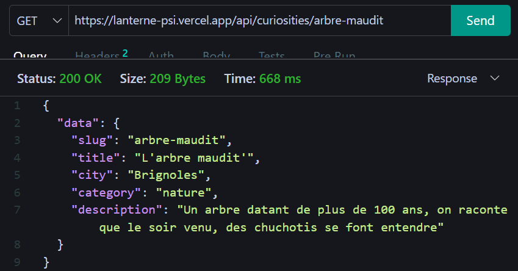
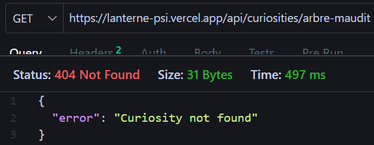

# Déploiement sur Vercel

## Prérequis
- Compte Vercel
- Repository GitHub 
- Node.js 20.x, 22.x, 24.x
- fichiers sensibles (.env, node_modules) à mettre dans le .gitignore
- vercel.json : la redirection des routes

## Installation locale 
- npm install (installer les dépendances)
- node index.js (lancer le serveur)

### Arborescence
```
Projet_Lanterne
|
├── api
|    └── data
|    |     └── curiosities.json
|    └── index.js
├── docs
└── tests
└── package-lock.json
└── package.json
└── vercel.json
```
## Liaison avec Vercel 
Lier son compte Vercel à son GitHub.

## Les environnements Preview et Production
**Environnement preview** : utiliser pour réaliser des tests sans impacter le site final

**Environnement de production** : les changements finaux sont établis, le site est prêt à être utilisé par les utilisateurs.
**ATTENTION** Les valeurs de production ne doivent pas être stockés dans votre repository car ce sont des clés secrètes et permettent la configuration du projet.

## Les variables d’environnement
Utiliser les vraies clés d'environnement dans les valeurs demandées par Vercel lors de la configuration du projet.

## Le déploiement
Une fois tous les prérequis sont installés et configurés: 
- j'initialise le déploiement sur Vercel `https://vercel.com/` en utilisant un repository Github existant.
- je mets en place le routage vers mon api/index.js à partir d'un fichier vercel.json (situé  la racine du projet)

            ```JSON
            {
            // Version de déploiement
            "version": x,
            //compilation des fichiers
            "builds": [
                {
                "src": "api/index.js", //point d'entrée d'Express
                "use": "@vercel/node" //Utilise node
                }
            ],
            //Redirection
            "routes": [
                {
                "src": "/(.*)", //Selectionne toutes les routes
                "dest": "api/index.js"  //vers ce fichier
                }
            ]
            }
            ```
- Sur Vercel, j'entre les différentes valeurs du .env nécessaire à la configuration du déploiement
- Cliquer sur "Deploy"

URL public de mon projet : `https://lanterne-psi.vercel.app/`

## La mise à jour et le retour arrière

Mise à jour sur le fichier curiosities.json :
```json
{
    "slug": "arbre-maudit",
    "title": "L'arbre maudit'",
    "city": "Brignoles",
    "category": "nature",
    "description": "Un arbre datant de plus de 100 ans, on raconte que le soir venu, des chuchotis se font entendre"
}
```
Après avoir poussé ma modification sur GitHub, le déploiement sur Vercel de cette nouvelle version se fait automatiquement.

- `Get /api/curiosities/arbre-maudit`

Status code attendu : 200

Status code obtenu : 200



Retour en arrière :

Sur Vercel, dans la section **Overview** de mon projet, j'utilise **Instant Rollback** pour revenir à la version précédente.



Status code attendu : 404

Status code obtenu : 404