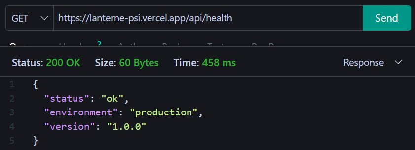
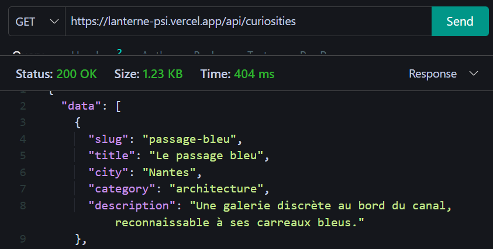
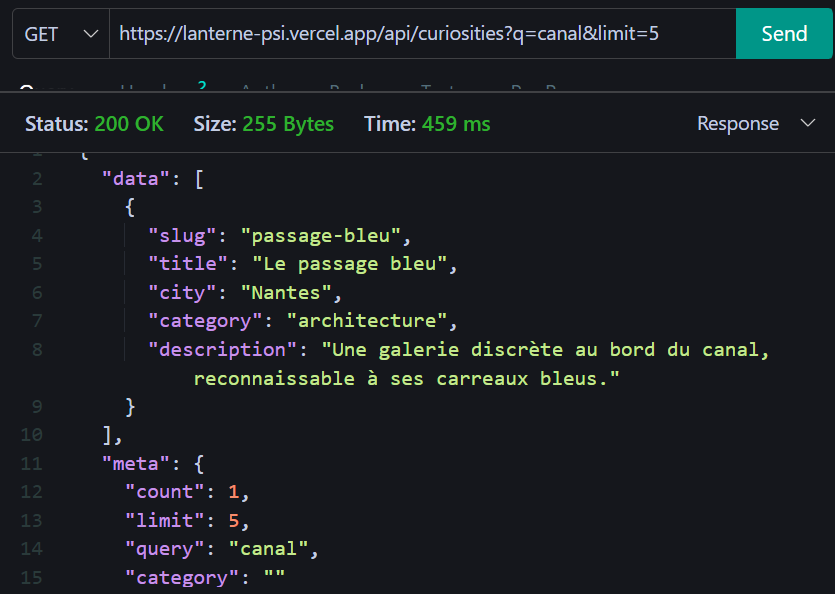
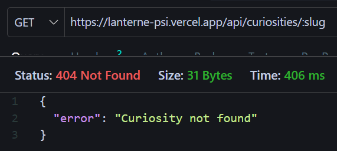
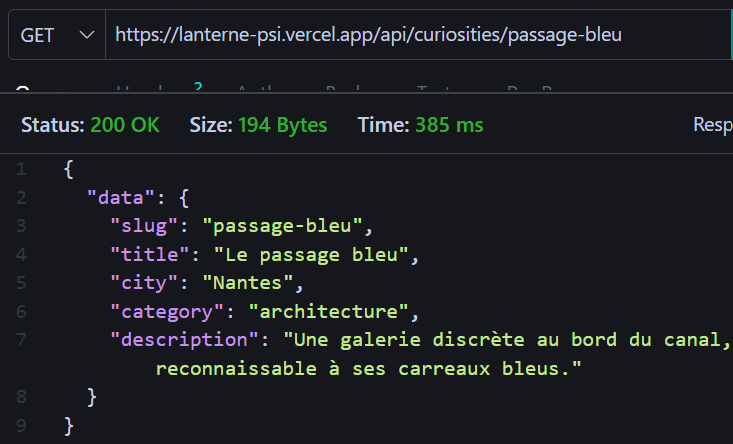

# Validation

## les requêtes exécutées sur l’URL publique

- `GET /api/health`

Status code attendu : 200 

Status code obtenu : 200

- `GET /api/curiosities`

Status code attendu : 200 

Status code obtenu : 200

- `GET /api/curiosities?q=canal&limit=5`

Status code attendu : 200 

Status code obtenu : 200

- `GET /api/curiosities/:slug`

Status code attendu : 404 

Status code obtenu : 404

- `GET /api/curiosities/passage-bleu`

Status code attendu : 200 

Status code obtenu : 200

